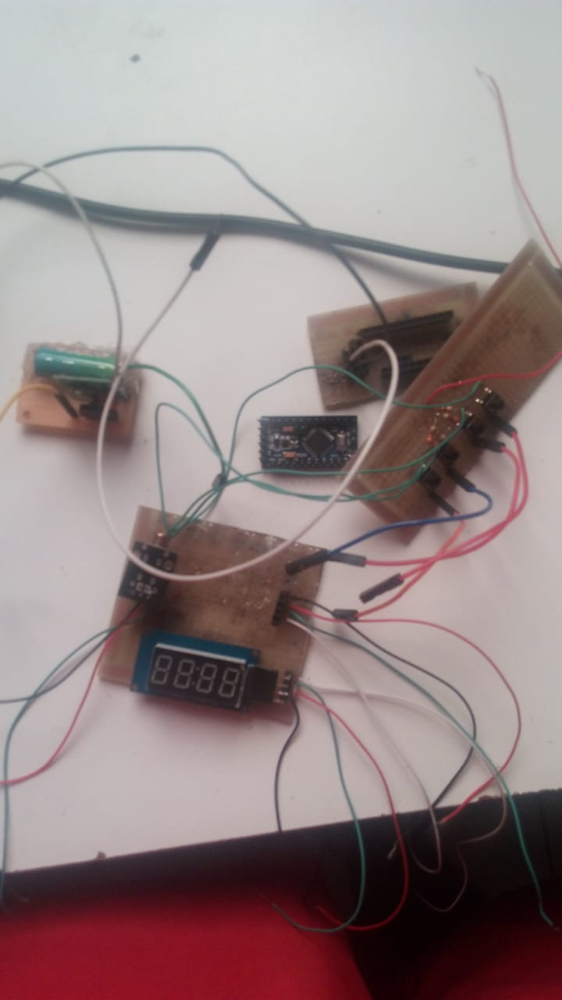
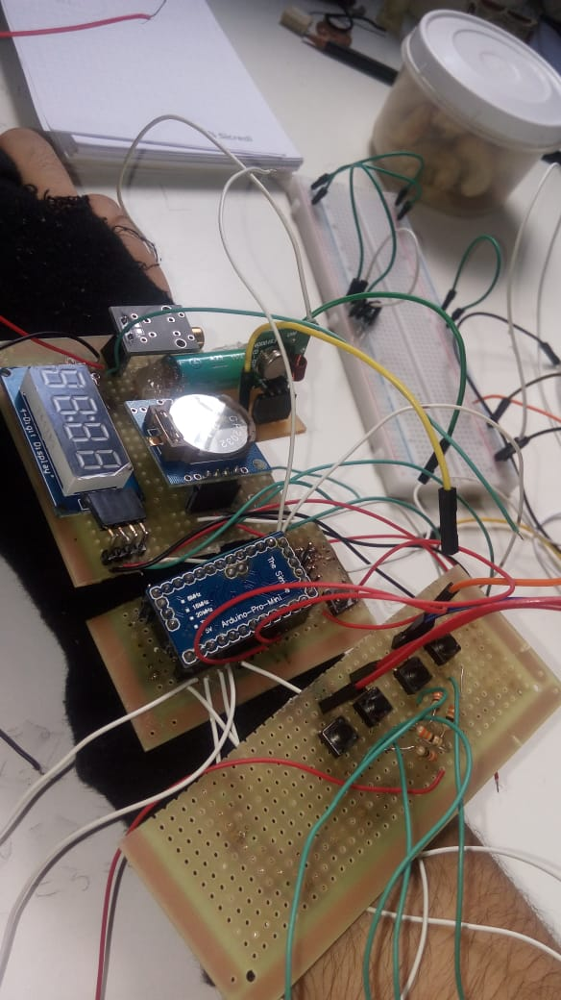

# Relógio Arduino

## Descrição

Criando um relógio com um Arduino que inclui as seguintes funcionalidades:

- GPS
- RTC (Relógio de Tempo Real)
- Alarme
- Timer de contagem regressiva
- Cronômetro
- Módulo RF para abrir o portão RC do prédio
- Laser

Este projeto foi um teste para integrar várias funcionalidades em um relógio baseado em Arduino.
Fotos.... XD

  
  

